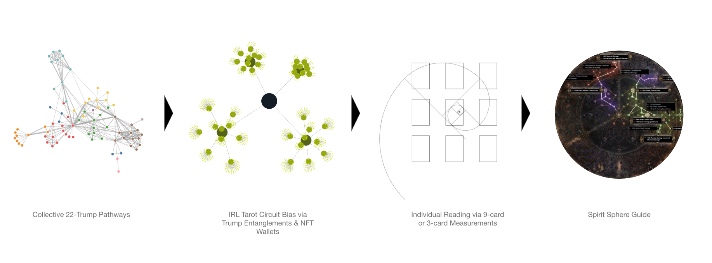
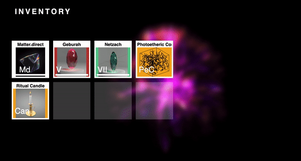

# whisper
at times of confliction, one require peace to meet the state of equilibirum for the possibility for regeneration to emerge in the chord of alchemy cooridnation

While aiming to bridge various tools sets in a cohesive package for information reproduceability, this project can be considered more of a no-code implementation of intelligence to come.

whisper places community cohesion in the forefront, so as the quiet whispers of light may protect those practioners seeking continual wisdom in the infinite game we may play

## epochs
each epoch of time celebrates the various nodes of the kabbalah tree, where each tarot reading performed and shared amongst the collective provides a crystal as ritual participation. 

as tarot get performed, software may connect to a PoS validators graffiti.yml file to represent a type of hierarchial progression of running myth software in a community. overlaying human affordances into compute stake financials, where optimization of outcomes might be tuned towards signifers e.g. magus. 

Q: can magus role embeddings in a community be measured for positive impact vitality redirection?

## tarot quantum embedding
what begain as a small game as percolated into a matter of form by which cards are distributed IRL to create default stepping stone for memetic rotations to take form

example project beginning: https://pennylane.ai/qml/demos/tutorial_qgrnn.html

## architecture

## quantum circuit
|--X-OR-->

## inventory guiding

## results
TODO
